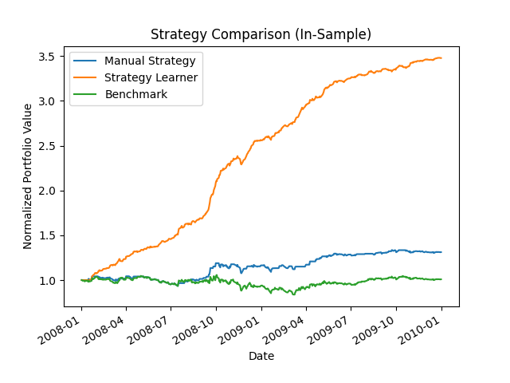
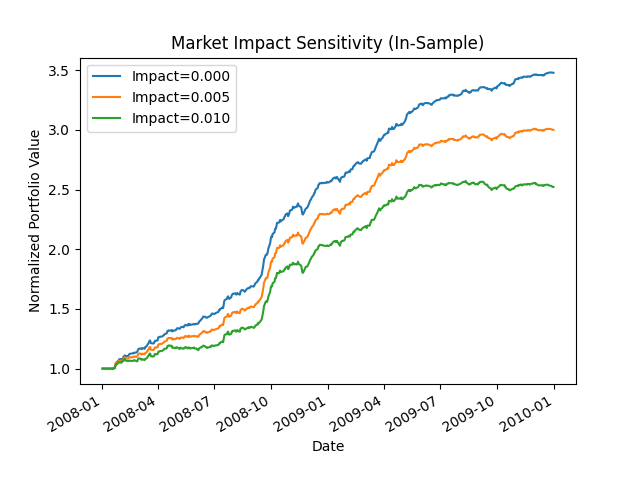

# Strategy Evaluation: Q-Learning vs Rules-Based Trading

A comparison of reinforcement learning and rules-based trading strategies on JPM equity data. The RL agent uses tabular Q-learning with Dyna-Q experience replay; the rules-based strategy votes across three technical indicators. Both are evaluated against a buy-and-hold benchmark on the same portfolio simulator with configurable transaction costs.

---

## Results

### Experiment 1 — In-Sample Strategy Comparison (2008–2009)



The Strategy Learner (orange) reaches **~3.5× return** over the in-sample training window. This is expected — the agent has seen this data hundreds of times. The Manual Strategy (blue) achieves **+31.2%** cumulative return vs the benchmark's **+18.9%**, with lower daily volatility (σ = 0.00765 vs 0.00781). The benchmark (green) is roughly flat through the 2008 financial crisis.

| Metric | Manual Strategy | Benchmark |
|---|---|---|
| Cumulative Return | +31.2% | +18.9% |
| Std Daily Return | 0.00765 | 0.00781 |
| Mean Daily Return | 0.000568 | 0.000374 |

### Experiment 2 — Market Impact Sensitivity (In-Sample)



The same RL trade schedule is run through the simulator at three impact levels. Final return drops from **3.5× → 3.0× → 2.5×** as market impact rises from 0 to 0.5% to 1.0% per trade. This confirms the reward-shaping approach works: the agent learns to trade less aggressively when slippage is modeled.

### Manual Strategy — In-Sample vs Out-of-Sample

| | In-Sample (2008–2009) | Out-of-Sample (2010–2011) |
|---|---|---|
| Manual Strategy | +31.2% | ~flat (slight negative) |
| Benchmark | +18.9% | −15% |


The Manual Strategy avoids the benchmark's −15% drawdown out-of-sample, though the dense trade signals (visible as vertical lines) suggest the voting thresholds trigger on most days — a known limitation noted below.

---

## Approach

### Technical Indicators

Three indicators are computed from adjusted close prices over a 10-day rolling window:

| Indicator | Formula | Signal |
|---|---|---|
| SMA Ratio | price / rolling_mean(price, 10) | > 1.02 → sell; < 0.98 → buy |
| Bollinger Band % | (price − lower) / (upper − lower) | > 1.5 → sell; < −0.5 → buy |
| Momentum | (price − price[t−10]) / price[t−10] | > 1.02 → sell; < 0.98 → buy |

### State Space Design

Each indicator is quantile-binned into 10 discrete buckets using `pd.qcut`, ensuring roughly equal population per bin. The three bin labels are combined into a single integer:

```
state = 100 × bb_bin + 10 × sma_bin + momentum_bin
```

This yields up to **1000 distinct states** (10³), which fits comfortably in a tabular Q-table.

### Q-Learning with Dyna-Q

The agent (`QLearner`) implements the Bellman update:

```
Q[s, a] ← (1 − α) · Q[s, a] + α · (r + γ · max_a' Q[s', a'])
```

Key hyperparameters (all externalized in `config.yaml`):

| Parameter | Value | Role |
|---|---|---|
| α (alpha) | 0.2 | Learning rate |
| γ (gamma) | 0.9 | Discount factor |
| RAR | 0.8 | Initial exploration rate |
| RADR | 0.9 | Exploration decay per step |
| Dyna steps | 0 | Hallucinated updates per real step |

**Dyna-Q** (disabled by default) adds extra Q-table updates per real step by sampling from a learned transition model `T[s, a, s']`. This amortizes the cost of environment interaction and converges significantly faster when enabled.

### Reward Shaping

The daily reward is scaled by position direction and penalized for market impact:

```
reward = holding × (daily_return − impact × direction_sign)
```

This teaches the agent to factor transaction costs into its policy during training, rather than discovering them only at evaluation time.

### Convergence

Training runs repeated episodes over the in-sample window until the final portfolio value changes by less than **$100** between consecutive episodes, with a minimum of **30 episodes**.

---

## Project Structure

```
finance-bot/
├── src/strategy_evaluation/
│   ├── q_learner.py          # Tabular Q-learning + Dyna-Q
│   ├── strategy_learner.py   # RL trading agent built on QLearner
│   ├── manual_strategy.py    # Three-indicator voting strategy
│   ├── market_simulator.py   # Portfolio simulator with costs
│   ├── indicators.py         # SMA ratio, BBP, Momentum
│   ├── experiment1.py        # Strategy comparison chart
│   ├── experiment2.py        # Impact sensitivity chart
│   ├── plotting.py           # Shared chart helper
│   └── util.py               # Data loader with yfinance auto-fetch
├── scripts/
│   └── run_experiments.py    # Main entrypoint
├── tests/
│   ├── test_q_learner.py     # Bellman update, RAR decay, Dyna-Q, reproducibility
│   ├── test_indicators.py    # SMA, BBP, momentum on synthetic price series
│   └── test_market_simulator.py  # Buy/sell accounting, commission, impact
├── outputs/                  # Generated charts (git-tracked as .gitkeep)
├── data/                     # CSV price data (auto-fetched, not committed)
├── config.yaml               # All hyperparameters in one place
├── pyproject.toml            # Package metadata and dependencies
└── environment.yml           # Conda environment (Python 3.11)
```

---

## Installation

**Conda (recommended):**
```bash
conda env create -f environment.yml
conda activate finance-bot
```

**pip:**
```bash
pip install -e ".[dev,data]"
```

---

## Usage

```bash
python scripts/run_experiments.py
```

Market data is fetched automatically from Yahoo Finance on first run and cached under `data/`. Subsequent runs use the local cache and require no network access. Charts are written to `outputs/`.

**Run tests:**
```bash
pytest
```

**Change hyperparameters:**  
Edit `config.yaml` — no source changes needed.

**Use a different ticker or date range:**  
Edit the constants at the top of `scripts/run_experiments.py`:
```python
SYMBOL          = "JPM"
IN_SAMPLE_START = dt.datetime(2008, 1, 1)
IN_SAMPLE_END   = dt.datetime(2009, 12, 31)
OUT_SAMPLE_START = dt.datetime(2010, 1, 1)
OUT_SAMPLE_END   = dt.datetime(2011, 12, 31)
START_VAL       = 100_000
```

---

## Known Limitations

- **In-sample RL returns are inflated.** The Strategy Learner's 3.5× in-sample return reflects memorization of the training window, not generalization. Out-of-sample evaluation of the RL strategy is left for future work.
- **Manual Strategy over-trades.** The voting thresholds (±2% for SMA/momentum, −0.5/+1.5 for BBP) trigger on nearly every day during volatile periods, as visible from the dense trade markers in the in-sample chart. Wider thresholds or a minimum holding period would reduce churn.
- **State space discretization is static.** Quantile bins are computed once over the training window. The bin edges do not adapt if the out-of-sample distribution shifts significantly.
- **Single-asset, long-short only.** The agent trades ±1000 shares of one ticker with no position sizing or portfolio-level risk management.
